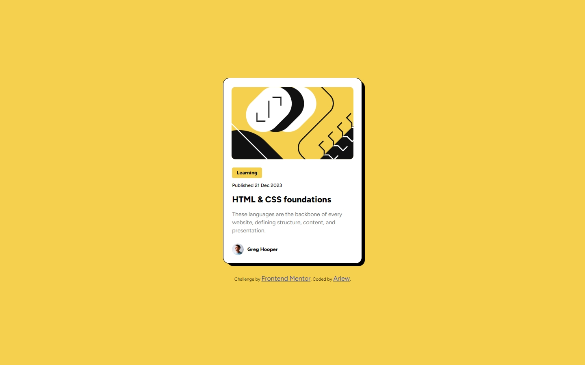

# **_Frontend Mentor - Blog preview card solution_**

This is a solution to the [Blog preview card challenge on Frontend Mentor](https://www.frontendmentor.io/challenges/blog-preview-card-ckPaj01IcS). Frontend Mentor challenges help you improve your coding skills by building realistic projects.

## Table of contents

[**Frontend Mentor - Blog preview card solution**](#frontend-mentor---blog-preview-card-solution)

Table of contents

- 🔵 [Overview](#overview)
  - 🟢 [Screenshots](#screenshots)
  - 🟢 [Links](#links)
  - 🟢 [Built with](#built-with)
  - 🟢 [Useful resources](#useful-resources)
- 🟠 [Author](#author)

## **Overview**

These are some of the tools and processes that led me to complete this blog preview card

### **Screenshots**

<<<<<<< HEAD

### Links

- Solution URL: [Solution URL](https://github.com/RomPirsZ/blog-preview-card-main)
- Live Site URL: [Live Site](https://rompirsz.github.io/blog-preview-card-main/)

### Built with

- Semantic HTML5 markup
- CSS custom properties
- Flexbox
- Mobile-first workflow

### Useful resources

- [Responsively.app](https://responsively.app/) - This application has helped me with the screens that the project needs to be more responsive

## Author

- Website - [My website](https://rompirsz.github.io//)
- Frontend Mentor - [@RomPirsZ](https://www.frontendmentor.io/profile/RomPirsZ)
